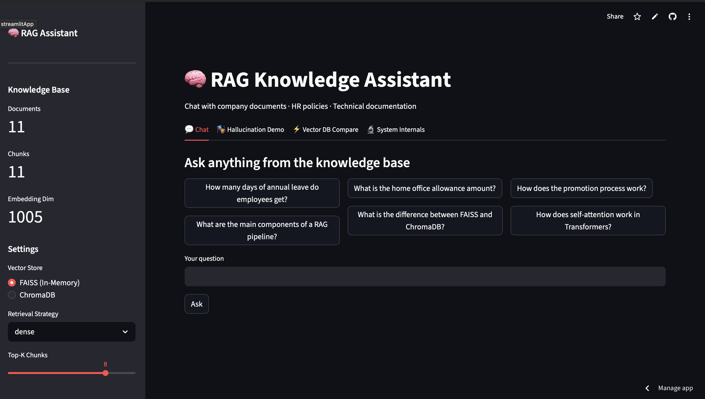
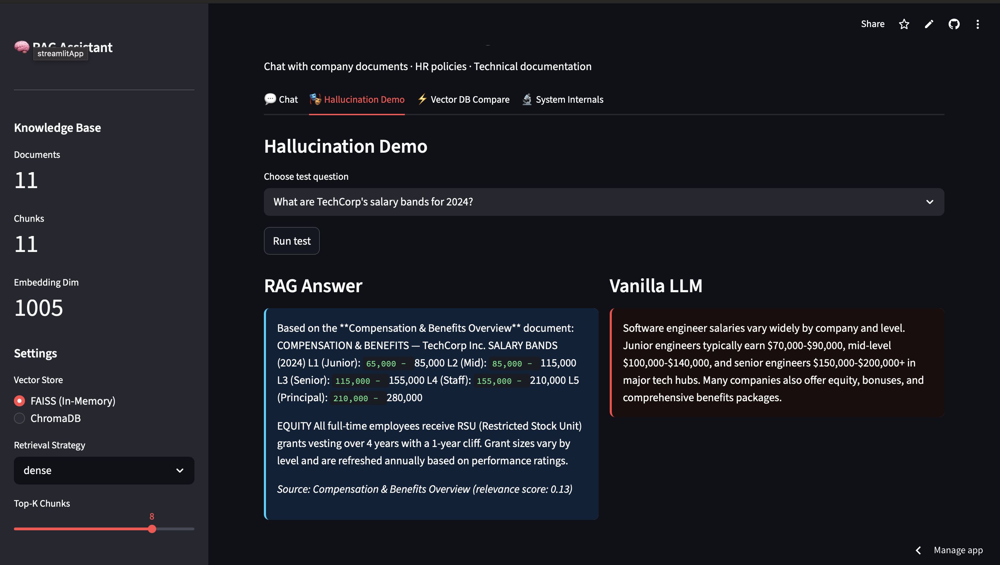
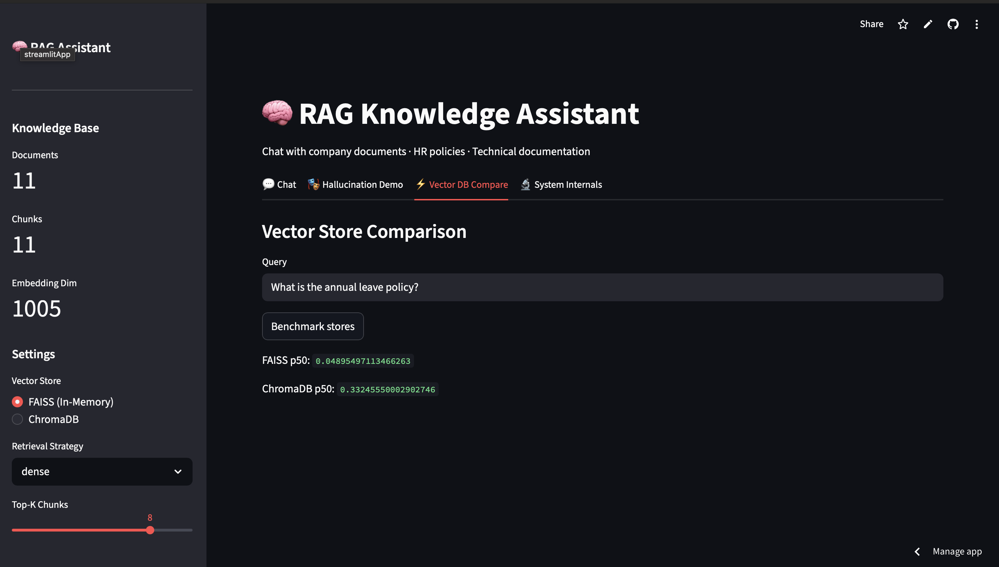
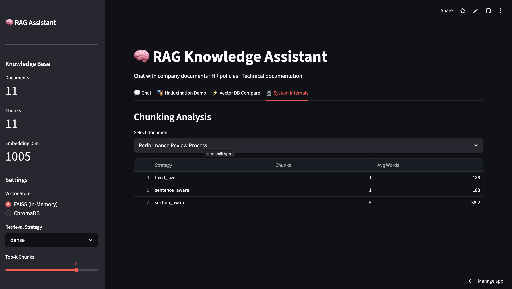

# 🧠 RAG Knowledge Assistant – Retrieval Augmented Generation System

An interactive **Retrieval-Augmented Generation (RAG) system** built with Python and Streamlit that demonstrates how Large Language Models can reduce hallucinations by retrieving relevant document context before generating answers.

This project simulates a **knowledge assistant for company documents**, including HR policies and technical documentation, while also visualizing the internal mechanics of a RAG pipeline.

---

# 🚀 Live Demo

Try the deployed application here:

[https://YOUR_STREAMLIT_APP_LINK](https://rag-knowledge-assistant-mnezxdakplvzabvkpm95pi.streamlit.app)

---

# 📊 Application Dashboard

The main chat interface allows users to query internal documents and receive grounded answers retrieved from the knowledge base.

---

# 🎭 Hallucination Demonstration

The system compares **RAG responses** against **vanilla LLM responses** to highlight how retrieval reduces hallucinated information.

---

# ⚡ Vector Database Comparison

The system compares two vector storage implementations:

- **FAISS (In-memory vector search)**
- **ChromaDB-style persistent vector store**

This module benchmarks search latency and demonstrates how vector databases power RAG systems.

---

# 🔬 System Internals

The application includes visualization tools to understand how RAG works internally.

Features include:

- Chunking strategy comparison
- TF-IDF embedding visualization
- Retrieval similarity scoring
- Document chunk distribution

---

# 📊 Project Features

- Interactive **RAG chat assistant**
- Hallucination comparison between **RAG vs Vanilla LLM**
- Vector store benchmarking (**FAISS vs ChromaDB**)
- Document chunking analysis
- Embedding visualization
- Retrieval pipeline tracing
- Interactive dashboard built with **Streamlit**

---

# 🧠 RAG Pipeline Overview

The system follows a typical Retrieval-Augmented Generation workflow.
